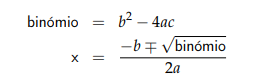
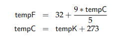
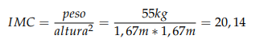
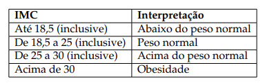
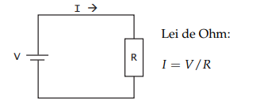

# Algoritmia - Exercícios de Revisão

1. Classificar um triângulo quanto aos lados, sendo que um triângulo com todos lados iguais é designado Equilátero, com todos os lados diferentes entre si é designado Escaleno e caso tenha apenas dois lados iguais entre si, designa-se Isósceles.

2. Descreva um algoritmo que dados dois valores, divide o primeiro pelo segundo. Note que não é possível fazer a divisão por zero, neste caso deve ser apresentada a mensagem adequada.

3. Calcular as raízes de uma equação na forma ax2 + bx + c = 0. Note que os valores a, b e c podem ser zero, podendo dar origem a equações sem solução ou equações de primeiro grau.

4. Escrever um programa que faça conversões entre as três escalas de temperaturas, Kelvin, Celsius e Fahrenheit, com base em três valores de entrada: a temperatura e escala actual e escala pretendida. Conforme o seguinte exemplo:
As entradas 38, ’C’ e ’K’, significam que o utilizador pretende converter a temperatura 38 Celsius para Kelvin.

5. O índice de massa corpórea (IMC) de um indivíduo é obtido dividindo-se o seu peso (em Kg) por sua altura (em m) ao quadrado. Assim, por exemplo, uma pessoa de 1,67m e pesando 55 Kg tem IMC igual a 20,14, já que:

Escreva um programa que leia o peso em kg e a altura em m de uma determinada pessoa de forma a calcular o índice de massa corpórea do mesmo e de seguida, estabeleça as comparações necessárias entre o IMC calculado e os valores da tabela e escreva uma das frases, conforme for o caso:

Você está abaixo do peso normal.
* O seu peso está na faixa de normalidade.
* Você está acima do peso normal.
* Você precisa de perder algum peso.

6. Um ano é bissexto se é divisível por 4, excepto se, além de ser divisível por 4, for também divisível por 100. Então ele só é bissexto se também for divisível por 400. Escrever um algoritmo que leia o valor de um ano e escreva se o ano é ou não bissexto.

7. Considere um parque de estacionamento que pratica os preços seguintes:
* 1ª hora: 2€
* 2ª hora: 1,5€
* a partir da 2ª hora: 1 €/hora

O tempo de permanência no parque é contabilizado em horas e minutos. Por exemplo, se uma viatura permanecer 2 horas e 30 minutos no parque, pagará 2€ (1ª hora) + 1,5€ (2ª hora) + 0,5€ (30 minutos a 1 €/hora) = 4€.
Elabore um algoritmo que, lido o tempo que determinada viatura permaneceu estacionada no parque, diga a quantia que deve ser paga.

8. O resultado da divisão inteira de um número inteiro por outro número inteiro pode sempre ser obtido utilizando-se apenas o operador de subtracção. Assim, se quisermos calcular 7/2, basta subtrair o dividendo (2) ao divisor (7), sucessivamente, até que o resultado seja menor do que o dividendo. O número de subtracções realizadas corresponde ao quociente inteiro, conforme o exemplo seguinte:

* 7 - 2 = 5
* 5 - 2 = 3
* 3 - 2 = 1

Descrever um algoritmo para o cálculo da divisão de um inteiro pelo outro. Note que se o dividendo for zero, esta é uma operação matematicamente indefinida.

9. Ler 100 valores e determinar os valores máximo e mínimo da série.

10. Determinar quantos são os números primos existentes entre os valores 1 e 1000 (excluindo os limites do intervalo).

11. Um número n é perfeito se a soma dos divisores inteiros de n (excepto o próprio n) é igual ao valor de n. Por exemplo, o número 28 tem os seguintes divisores: 1, 2, 4, 7, 14, cuja soma é exactamente 28. (Os seguintes números são perfeitos: 6, 28, 496, 8128). Escreva um algoritmo que verifique se um número é perfeito.

12. Escrever um programa que permita calcular uma potência do tipo base^expoente através de multiplicações sucessivas. Por exemplo: 2^4 = 2 ∗ 2 ∗ 2 ∗ 2. Considere as diferentes situações relacionadas com os valores da base e/ou expoente iguais a zero.

13. Descreva um algoritmo que lê uma sequência de números inteiros terminada pelo número zero e calcule o maior ímpar e a sua posição na sequência de valores.

14. Escreva um programa para extrair os algarismos que compõem um número e os visualize individualmente.

15. Escreva um algoritmo que lê a temperatura de N cidades portuguesas e que represente a temperatura de cada uma delas com uma barra de asteriscos (*), em que cada asterisco representa um intervalo de 2◦C. De acordo com os exemplos seguintes:

* Porto 11 *****
* Lisboa 16 ********
* Faro 20 **********
* Chaves 8 ****

16. Escreva um programa que calcule a soma dos algarismos que compõem um número. Por exemplo: 7258 = 7+2+5+8 = 22

17. Escrever um programa para o o jogo de adivinhar um número. Este jogo consiste no seguinte: o programa sorteia um número e o jogador deve tentar adivinhar o número sorteado. Para isso o programa deve indicar se o palpite do jogador foi maior, menor ou se acertou no número sorteado. Caso o jogador acerte deve visualizado no écran
o número de tentativas utilizadas.

18. Escreva um programa que leia um número inteiro positivo e verifique se se trata de uma capicua, isto é, uma sequência de dígitos cuja leitura é a mesma nos dois sentidos (exemplo:32523). Sugestão: Inverter a ordem dos dígitos e verificar se o número obtido coincide com o original. Por exemplo, 327 invertido é ((7*10)+2)*10+3=723.

19. Escrever uma função que recebe um número inteiro e devolve o maior algarismo contido nesse número.

20. Escreva uma função que, dados dois números reais, retorna a média deles arredondada para um inteiro, e devolve os números por ordem crescente. Faça um programa que permita testar a função anterior.

21. A lei de Ohm é uma relação entre a corrente (I), a tensão (V) e a resistência (R), de acordo com o circuito eléctrico representado na figura:

a) Escreva uma função que recebe os valores de V e R como parâmetros, e calcule a corrente I.
b) Escreva um programa que permita testar a função anterior

22. Escreva um procedimento que imprima os números primos existentes entre dois números. Na resolução deste problema deve ser utilizada uma função que determina se um número é primo.

23. Faça a leitura das pontuações que 5 juízes de uma determinada prova atribuíram a
um atleta (valores compreendidos entre 0 e 9 inclusive). Determine e apresente com
formato adequado, os seguintes valores:
* média obtida pelo atleta;
* a pior e a melhor pontuação;
* a percentagem de pontuações iguais ou superiores a 8 valores;
* supondo que a 1ª nota foi atribuída pelo juiz nº1 e assim sucessivamente determine os números dos juízes que atribuíram a melhor nota do atleta.